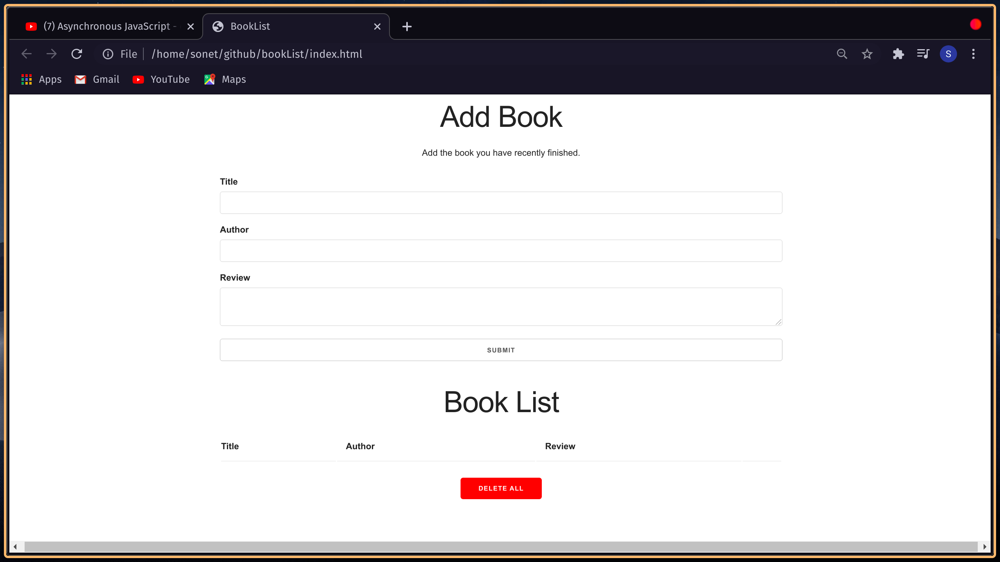
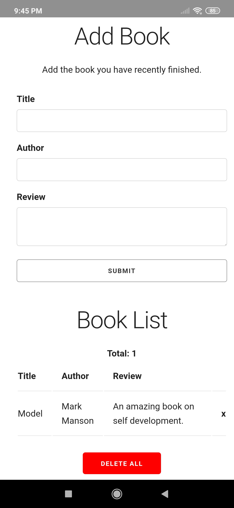

# Book-List

Book List is a simple application to helps book lovers to keep track of all books they have already read.

## Features:

- Readers can add book and creae their personal booklist.
- The app is intelligent enough to find out if there is any duplicate happend while adding a new book in the list.If user unconsciously added a book twice,it will show an error so that user can understand that this book is already in the list.

* Readers can delete the entire list together by pressing 'Delete All' button.
* App can intantly update the 'Total' book amount when a user add or delete any book in the list.The 'Title' ooption will disapear when there are no book in the list.

## Technical Details:

- This application has build with HTML5,CSS3 & Javascript.
- No external package has used here,just vanila Javascript.

* [Skeleton]('http://getskeleton.com/'),a css framework has used in this project.
* [Gonative]('https://gonative.io/') web service has used to build the app(convert web to app).

## Preview:

### Web

### App

## Developer:

Name: Sonet Adhikary  
Contact: sonet.ad101@gmail.com
